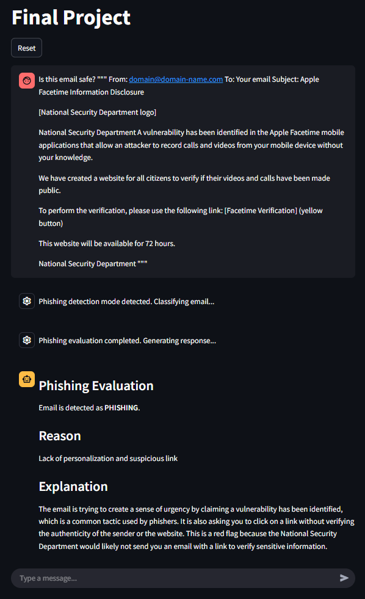
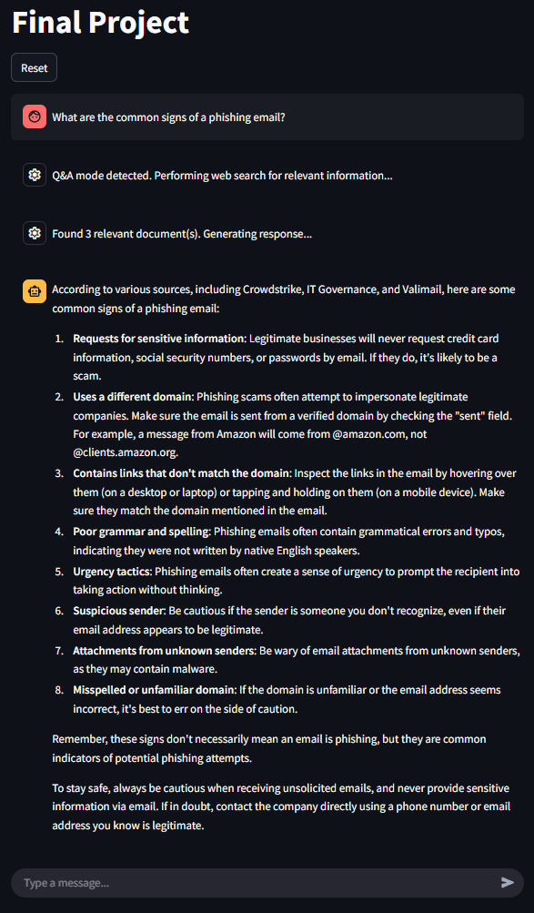

Collecting workspace information# LLM Cybersecurity Assistant

A Streamlit-based cybersecurity assistant that combines phishing detection and question-answering capabilities using fine-tuned language models.

## Features

### 🛡️ Dual-Mode Operation
- **Phishing Detection Mode**: Analyzes emails, URLs, and messages to identify phishing attempts
- **Q&A Mode**: Answers cybersecurity questions with context from web search

### 🤖 Multi-Model Architecture
- **Base Model**: Llama 3.1 8B for mode determination
- **Q&A Model**: Llama 3.1 ChatQA for answering questions
- **Phishing Detection**: Fine-tuned Gemma 1B for phishing classification

### 🔍 Intelligent Features
- Automatic mode detection based on user intent
- Web search integration for contextual Q&A responses
- BM25 retrieval system for similar email matching
- Real-time conversation tracking with Langfuse

## How It Works

### Mode Detection
The system automatically determines whether a user query is:
- **Phishing Detection**: When users provide specific text (email, URL, message) for analysis
- **Q&A**: When users ask general questions about cybersecurity

### Phishing Detection Pipeline
1. Analyzes user-provided content (emails, URLs, messages)
2. Retrieves similar emails from the database using `find_similar_emails`
3. Uses fine-tuned Gemma model via `classify_phishing_pretrained` for classification
4. Returns detailed evaluation with reasoning and explanation

### Q&A Pipeline
1. Performs web search using `search_and_fetch_contents`
2. Generates contextual responses using `answer_question`
3. Maintains conversation history for follow-up questions

## Installation

1. Install dependencies:
```bash
uv sync
```

2. Set up environment variables in .env:
```env
LANGFUSE_SECRET_KEY=your_secret_key
LANGFUSE_PUBLIC_KEY=your_public_key
DEEPINFRA_API_KEY=your_api_key
```

3. Initialize the BM25 retriever and embedding models

## Usage

Run the Streamlit application:
```bash
streamlit run main.py
```

### Example Queries

**Phishing Detection:**
```
Is this email safe?
"""
From: domain@domain-name.com
To: Your email
Subject: Apple Facetime Information Disclosure

[National Security Department logo]

National Security Department
A vulnerability has been identified in the Apple Facetime mobile applications that allow an attacker to record calls and videos from your mobile device without your knowledge.

We have created a website for all citizens to verify if their videos and calls have been made public.

To perform the verification, please use the following link: [Facetime Verification] (yellow button)

This website will be available for 72 hours.

National Security Department
"""
```


**Q&A Mode:**
```
What are the common signs of a phishing email?
```


## Architecture

### Core Components
- main.py: Streamlit interface and orchestration
- qa_mode.py: Question-answering logic and mode determination
- phishing_mode.py: Phishing detection and evaluation
- conversations.py: Conversation management
- llm.py: Language model interfaces
- embedding.py: Vector embeddings and similarity search
- search.py: Web search functionality

### Data Models
- `Mode`: Mode classification (qa/phishing_detection)
- `PhishingEvaluation`: Phishing analysis results
- `Conversation`: Chat message management

## Monitoring

The application integrates with Langfuse for:
- Conversation tracking
- Model performance monitoring
- Usage analytics

## Project Structure

```
├── main.py                 # Main Streamlit application
├── qa_mode.py             # Q&A mode logic
├── phishing_mode.py       # Phishing detection logic
├── conversations.py       # Conversation management
├── llm.py                 # Language model interfaces
├── embedding.py           # Vector embeddings
├── search.py              # Web search functionality
├── settings.py            # Configuration settings
├── utils.py               # Utility functions
├── datasets/              # Training datasets
├── email_chunks/          # Email data chunks
├── notebooks/             # Analysis notebooks
└── results/               # Evaluation results
```